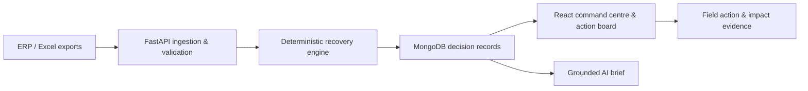

# VyaparPulse AI

**Open-source FMCG revenue-recovery decision support — from fragmented order-line data to explainable field actions and auditable impact.**

[Public repository](https://github.com/Rajat700700/vyaparpulse-ai-public)

## Why this product exists

FMCG enterprises and distributor networks often have the data needed to identify commercial leakage, but it is fragmented across ERP exports, spreadsheets and field workflows. Managers can see that performance moved; they still need a reliable way to identify where revenue is recoverable, what action should be taken, who owns it and whether the intervention produced verifiable impact.

VyaparPulse AI turns synthetic ERP/Excel order-line data into an operational decision loop:

1. Ingest and validate order-line data.
2. Detect explainable recovery opportunities.
3. Prioritise opportunities by value, confidence, urgency and strategic relevance.
4. Assign field actions to the appropriate commercial owner.
5. Attribute subsequent invoices inside a defined recovery window.
6. Produce grounded English and Hindi/Hinglish management briefs.

## Intended stakeholders

- Enterprise and regional sales leadership
- Commercial excellence and revenue-growth teams
- Distributor managers
- Front-line sales teams
- Product operations, analytics and transformation teams

## Core capabilities

- **Rules-first data ingestion:** CSV/XLSX validation, column mapping, duplicate protection and rejected-row feedback.
- **Deterministic recovery engine:** identifies lapsed outlets, declining business, missed order cycles and SKU whitespace.
- **Explainable prioritisation:** stores the components behind every priority score instead of returning an opaque recommendation.
- **Outlet 360 and action board:** connects opportunity discovery to accountable field execution.
- **Impact ledger:** attributes verified recoveries using defined dates, invoice evidence and calculation provenance.
- **Grounded AI briefs:** AI turns pre-calculated facts into concise management narratives; it does not perform financial arithmetic.
- **Multi-tenant controls:** tenant-scoped queries, role-based access, password hashing, secure cookies and brute-force protection.

## Business value

The product is designed to shorten the path from data to action, reduce repetitive spreadsheet analysis, improve field prioritisation and make commercial impact auditable. It demonstrates how applied AI can support decision quality without replacing deterministic controls for financial calculations.

## Architecture



See [Architecture and decision controls](docs/architecture.md) for more detail.

## Applied-AI guardrails

- Financial and recovery calculations remain deterministic Python logic.
- AI is limited to column-mapping assistance and narrative generation over pre-calculated facts.
- Narrative outputs are checked against the provided facts; a deterministic fallback is used when grounding fails.
- Tenant isolation and permission checks are enforced by the application, not delegated to the model.

## Technology stack

- **Backend:** Python, FastAPI, Motor/MongoDB, pandas, PyJWT, bcrypt
- **Frontend:** React, JavaScript, Tailwind CSS, shadcn/Radix components
- **AI layer:** grounded brief generation and assisted column mapping
- **Quality:** pytest, boundary tests, tenant-isolation tests and state-transition tests

## Synthetic-data and privacy statement

All distributors, outlets, salespeople, transactions, recovery values and operational scenarios in this public repository are fictional, deterministically generated demonstration data. Product and brand names may be used only to make the synthetic FMCG scenario understandable. The project is not affiliated with, endorsed by or supplied with data from any named company.

No employer, customer or distributor operational data is included. Do not use real business data in issues, pull requests or example files.

## Local setup

### Backend

```bash
cd backend
python -m venv .venv
source .venv/bin/activate
pip install -r requirements.txt
cp ../.env.example .env
uvicorn server:app --reload
```

Set strong local values in `.env`. Never commit the file.

### Frontend

```bash
cd frontend
yarn install
yarn start
```

Configure the frontend API base URL through the environment expected by `frontend/src/lib/api.js`.

## Testing

```bash
cd backend
pytest -q
```

Credential-dependent live integration tests are intentionally excluded from the public snapshot. The retained tests focus on deterministic rules, boundaries, tenant controls, workflow transitions and AI-grounding behaviour.

## Product leadership and contribution

**Rajat Kumar Mahajan** conceived the product problem, translated FMCG commercial workflows into the product model, designed the decision logic and stakeholder experience, defined AI and calculation guardrails, and orchestrated AI-assisted development, testing and deployment using Emergent.

This repository is presented transparently as an **AI-assisted open-source product and public proof of work**. It does not claim that every line was manually authored, nor does it claim third-party open-source contribution.

## Current limitations

- Demonstration data is synthetic and does not establish production ROI.
- ERP integrations, SSO, messaging, native mobile applications and enterprise deployment controls are outside this reference implementation.
- Production use requires an independent security review, infrastructure hardening, monitoring and data-governance approval.

## Contributing and security

See [CONTRIBUTING.md](CONTRIBUTING.md) before proposing changes. Report vulnerabilities according to [SECURITY.md](SECURITY.md), not through a public issue.

## Licence

Licensed under the [MIT License](LICENSE).
